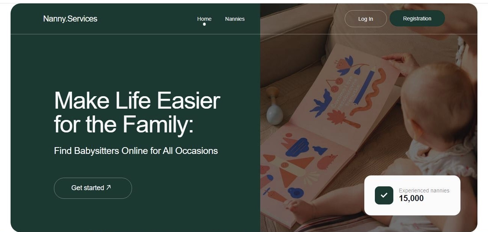
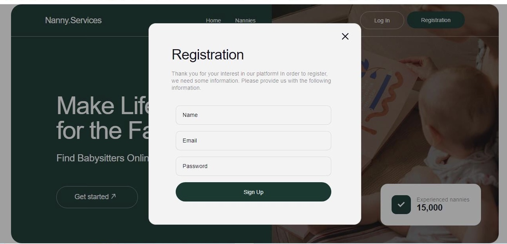
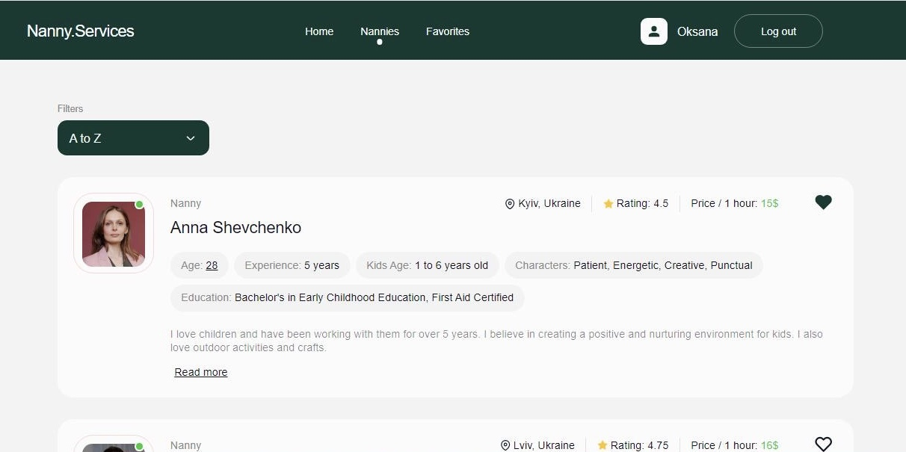
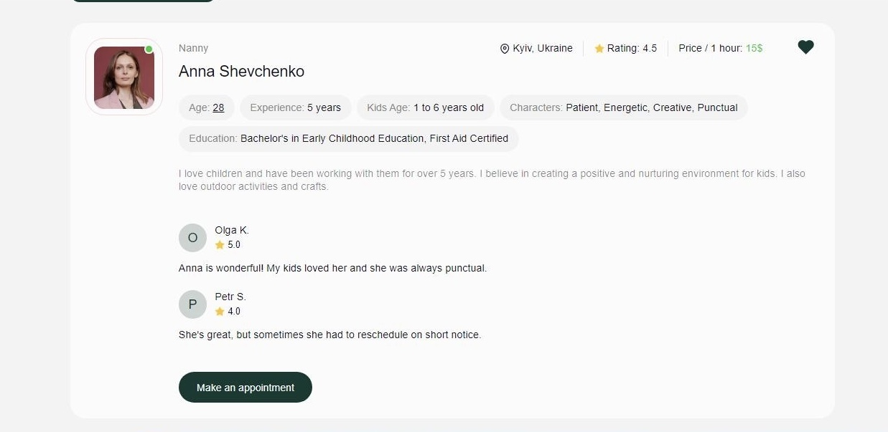
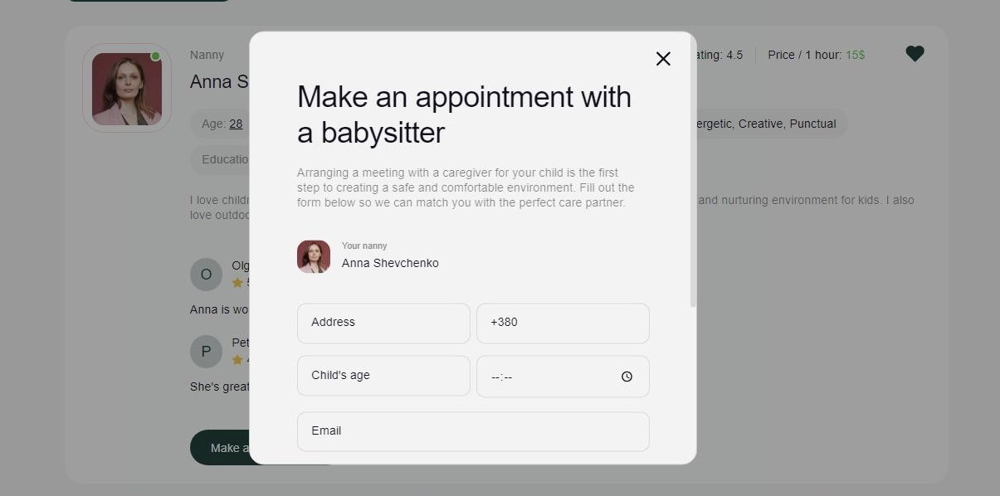
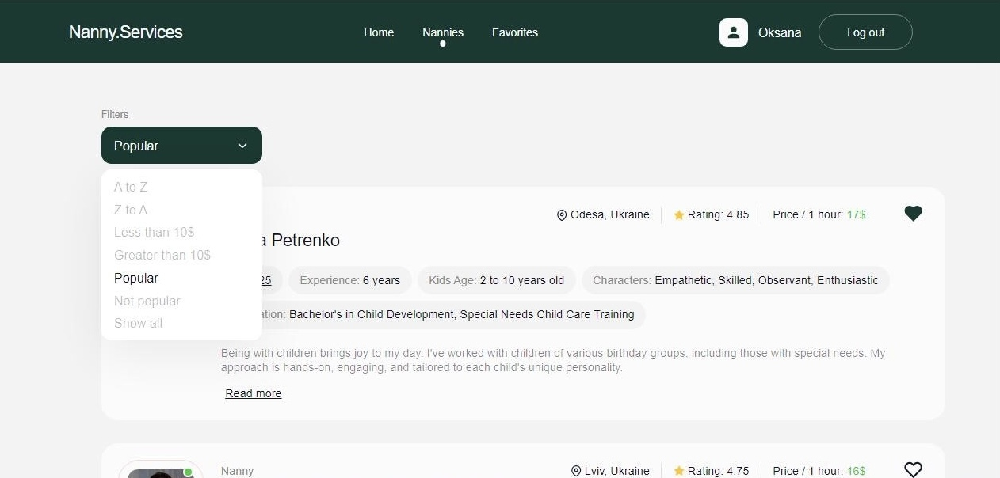
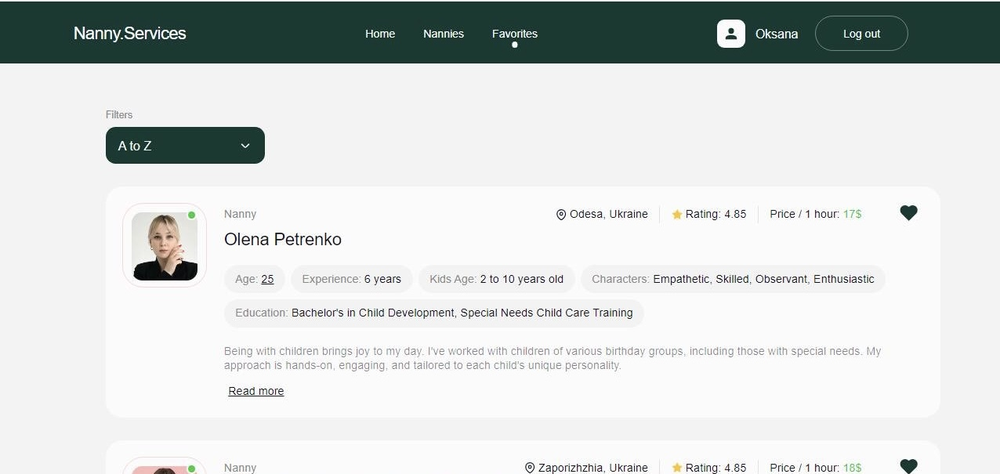

# Nanny-services

This project was created with the help of [Create Vite](https://vitejs.dev/).

This application for a company that offers to use the services of babysitters.

## About the project

With the help of the application, you can find the best babysitter for your
child. In the application, you can sort the list of babysitters by various
criteria, as well as to create your own list of babysitters that you liked the
most

The application consists of 3 pages: the Home page, the Nannies list and the
page with ads selected as favorites.

## Home page

The home page presents basic information about the company and the site
navigation panel 

In the navigation menu there are buttons for registration of new users and login
for already registered users 

## Nannies page

This page presents a list of nannies containing most important information. For
authorized users, when clicking on the button with the image of a heart, the
card is added to the list of favorites.

Clicking on the "Read more" button opens information about reviews and the
opportunity to make an appointment with this babysitter.

When you click on the "Make an appointment" button, a modal window for filling
out the application opens

Also, the user can sort the list of babysitters alphabetically - ascending (from
A to Z) or descending (from Z to A), filter by price, sort by popularity - from
the lowest rating to the highest.

## Favorites page

This page contains a list of ads added to your favorites

## Technologies used:

- JavaScript
- React
- HTML
- CSS
- Git
- GitHub
- Vite

## Used libraries:

- react-hook-form
- react-loader-spinner
- react-modal
- react-redux
- react-router-dom
- redux-persist
- styled-components
- yup
- firebase

### Model [link](https://www.figma.com/file/u36ajEOsnwio2GDGiabVPD/Nanny-Sevices?type=design&node-id=0-1&mode=design&t=CZpMnnOCRwAYc81O-0)

### Technical task [link](https://docs.google.com/document/d/19ugM1gvOw81nCyALr4EZs3dmv6OfJm94VjupcytbnJY/edit)
